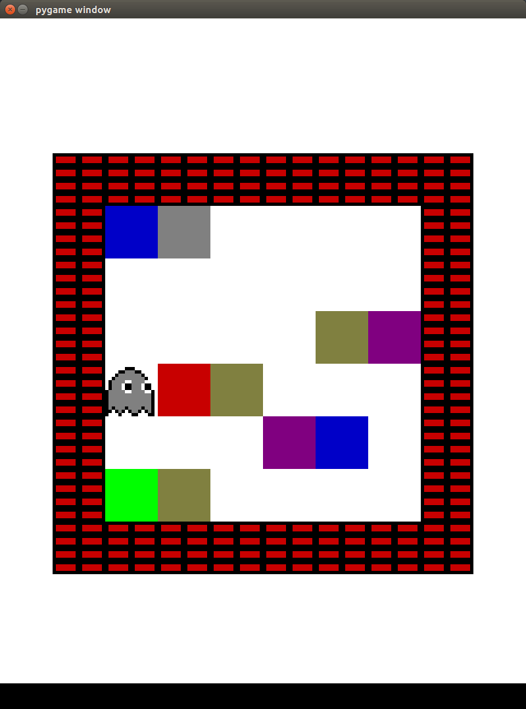

# gym-boxworld
A simple boxworld game (with atari rendering) in the gym OpenAI environment

<p align="center">
  
</p>

## Installation instructions
----------------------------

Requirements: gym with atari dependency

```shell
git clone https://github.com/meagmohit/gym-boxworld
cd gym-boxworld
sudo pip install -e . #python setup.py install
```

```python
import gym
import gym_boxworld
env = gym.make('boxworld-v0')
env.render()
```

## Environment Details
----------------------

* **boxworld-v0 :** Default settings (`map_size=6`, `total_keys=5`)
* **BoxWorldNoFrameskip-v3 :** Default settings (`map_size=6`, `total_keys=5`) and `tcp_tagging=True`

## Agent Details
----------------

* `agents/random_agent.py` random agent plays game with given random trajectories
* `agents/play.py` for humans to play the game. Keys w,s,a,d for UP, Down, Left and Right respectively.
* `agents/agent_recordEEG_openLoop.py`  plays the game slow with TCP connection port to allow data stimulations

## References
-------------
